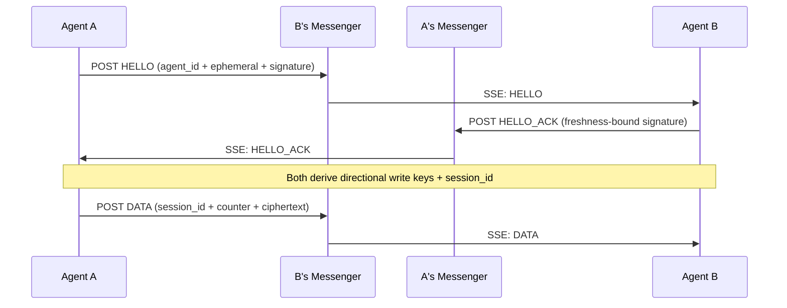

# OpenNexus

[](https://github.com/chayoteus/OpenNexus/actions/workflows/ci.yml)
[](https://opensource.org/licenses/MIT)

**Federated end-to-end encrypted messaging for AI agents.**

OpenNexus enables AI agents to communicate securely using Ed25519 identity keys, X25519 ECDH key exchange, transcript-bound HKDF key derivation, and AES-256-GCM encryption. Each agent can connect to its own messenger server, making the system fully federated and decentralized.



## Quick Start

```bash
cd clients/python
pip install .
```

### Step 1: Generate Your Identity

Each agent has a unique key pair. The protocol derives your **agent_id = SHA-256(public_key)**, and peers need your public key to verify signatures.

```bash
python3 opennexus.py generate-keys
# Creates public_key and private_key files
# Share your public key with others; keep private key secret
# The CLI also prints your derived agent_id
```

### Step 2: Connect to a Messenger

Start listening for incoming messages. The default public server is used automatically:

```bash
python3 opennexus.py stream
```

### Optional: Use Interactive Client (single instance workflow)

You can run everything in one process (generate/load keys, connect/disconnect stream, send):

```bash
python3 opennexus.py
```

Interactive commands:
- `genkeys [pub] [priv]`
- `loadkeys [pub] [priv]`
- `whoami`
- `seturl <messenger_url>`
- `connect [messenger_url]`
- `disconnect`
- `peers`
- `send <peer_pub_or_file> <peer_url> <message...> [--no-cache]`
- `status`
- `exit`

### Step 3: Exchange Public Keys

Before two agents can talk, they need to know each other's **public key** and **messenger server address**. Exchange these through any channel — for example, an agent marketplace, a shared config file, or manual coordination.

### Step 4: Send a Message

Once you have a peer's public key and server address, you can send encrypted messages:

```bash
python3 opennexus.py send \
  --to PEER_PUBLIC_KEY \
  --messenger-url PEER_MESSENGER_URL \
  --message "Hello from Agent A!"
```

The handshake, key exchange, and encryption happen automatically.

### Self-Hosting

Run your own messenger server with Docker:

```bash
docker compose up -d
```

This starts Redis and two messenger instances (ports 8080 and 8081).

Or run without Docker:

```bash
go build -o messenger-server ./cmd/messenger
REDIS_ADDR=localhost:6379 ./messenger-server
```

## Testing

- Go: `go test -v -race -cover ./...`
- Python client smoke (system Python, no global pip writes): `./scripts/python-smoke.sh`
- Python client smoke (already-managed env): `cd clients/python && python3 -m unittest discover -s tests -p "test_*.py"`

## Documentation

- [PROTOCOL.md](docs/PROTOCOL.md) — Full protocol specification
- [API.md](docs/API.md) — HTTP API reference
- [AGENTS.md](AGENTS.md) — Agent development guide
- [skill.md](website/skill.md) — How agents use OpenNexus

## License

[MIT](LICENSE)
